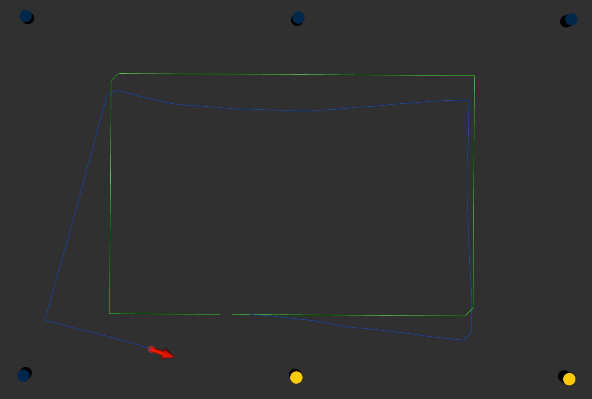

# ROB530-HW5-Localization
For this assignment, we will use [`ROS`](https://www.ros.org/) and `Python3` to execute the robot localization task.

## Dependencies
### System
The system dependency preparation depends on your local system. Basically, you need to install [Ubuntu](https://ubuntu.com/download/desktop) to complete this homework. We recommend `Ubuntu 20.04`.
* Linux (Ubuntu)
  * There is no preparation needed. Continue to install ROS :)
* Windows
  * You can set up a dual-boot system with Ubuntu.
  * You can use `Windows Subsystem for Linux` to install Ubuntu. You can check instructions on the [official website](https://docs.microsoft.com/en-us/windows/wsl/install) or the [recitation](https://umich.instructure.com/courses/499091/files/folder/winter-2022/recitation/Jingyu/Recitation%205%20ROS).
  * You can use virtual machine to install Ubuntu. The [VirtualBox](https://www.virtualbox.org/) is free.
* Mac
  * You can use `Bootcamp` to install set dual-boot system with Ubuntu.
  * You can use virtual machine to install Ubuntu. The [VirtualBox](https://www.virtualbox.org/) is free. The [Parallels Desktop](https://www.parallels.com/pd/general/?gclid=CjwKCAiAgbiQBhAHEiwAuQ6Bkqlt6f3diFGjX7eq3WRUtmwu2i4mzV-EWt_CJ9JVDx5AJtAsX0T13BoCA_gQAvD_BwE) is also good.
  * Note: If you're unable to visualize the robot in rviz, try disabling 3D acceleration in your virtual machine setting.
### ROS
You also need to install ROS (Robot Operating System) after installing Ubuntu. `ROS Noetic` is matched with the recommended `Ubuntu 20.04`. You can find the detailed installation instructions on [ROS Wiki](http://wiki.ros.org/ROS/Installation).

### Python Packages
These packages are required. You can install them by typing `pip install $package name$`.
* [NumPy](https://numpy.org/)
* [SciPy](https://scipy.org/)
* [PyYAML](https://pypi.org/project/PyYAML/)
* [Matplotlib](https://pypi.org/project/matplotlib/)

---
## Test Your Setup
We provide a dummy filter which you can run to test if you have set up your environment correctly.
1. Open a terminal, run ```roscore```.
2. Check `config/settings.yaml`, ensure the `filter_name` is set to `test`.
3. Open a new terminal, run ```rviz```.
4. We open a visualization config file. In your rviz, click `file` -> `open config`, choose `rviz/default.rviz` in the homework folder.
5. Open a new terminal, run ```python3 run.py```.
6. You should be able to see your a robot moving in `rviz`.
<!-- 
**Note:** We include a dummy filter in the code, which allows you to test if you have set up your environment correctly. To run the dummy filter, set `filter_name` to `test` in `config/settings.yaml` and do `python3 run.py`. -->
You should expect to see the visualization shown below. In this figure, `green path` represents command path without action noise, which is the path we want our robot to follow. `blue path` represents the exact path that the robot moves due to action noise. The `red ellipse` and the `red arrow` represent the filter prediction pose for the robot.


---
## Start Working
Now you have everything ready. You can start reading the assignment instructuons and start implementing your filter. Write your code and adjust the config settings before testing.

---
### Configurations
Parameters can be modified in `config/settings.yaml`.

**You will only need to modify** `filter_name` **and** `Lie2Cart`.

* `filter_name`: The filter you would like to run. Options include: `EKF`,`UKF`, `PF`, `InEKF`, and `test`.
* `Lie2Cart`: Set to `True` if you finish implementing the extra points question 2.E.

---
### Files you need to implement
* Implement all four filters. 
  * `filter/EKF.py`
  * `filter/UKF.py`
  * `filter/PF.py`
  * `filter/InEKF.py`
* Extra points
  * In `utils/util.py`, finish
    * `func()`
    * `lieToCartesian()`
    * `mahalanobis()`
<!-- --- -->
<!-- ## Visualization
We set up the visualization in rviz for you. To visualize the results in rviz, please follow the below steps:

1. In one terminal, open rviz.
2. In rviz, click `file` -> `open config`.
3. Choose `rviz/default.rviz` in the homework folder.
4. Open a new terminal, run your filter. You should be able to see a visualization of the filter. -->
